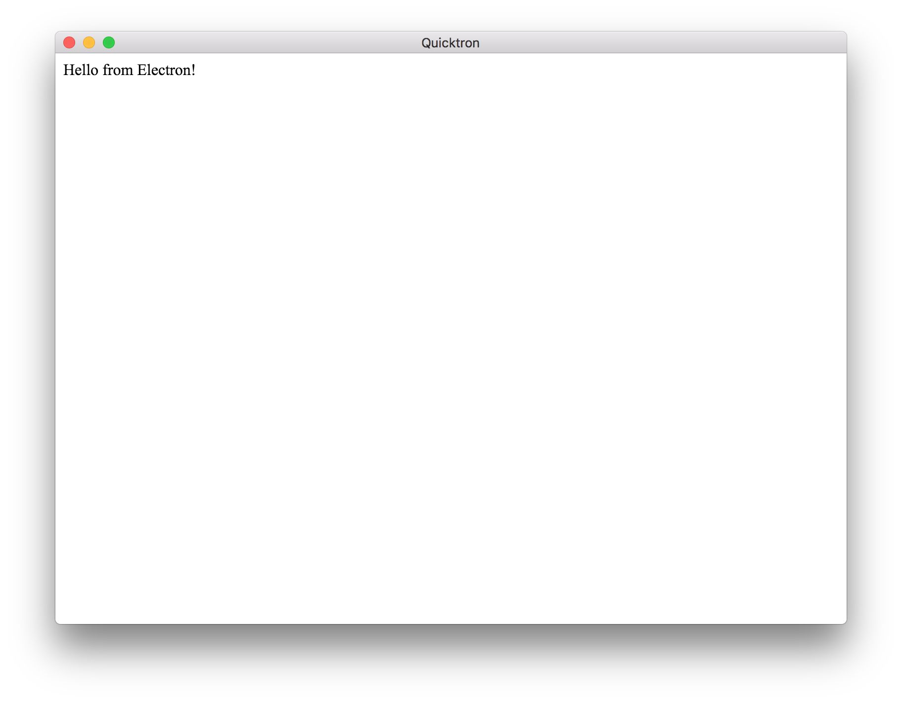

# quicktron

[](https://greenkeeper.io/)

Quickly load a script in an [electron](https://electron.atom.io/) window!

```bash
$ npm install -g quicktron
$ echo "document.body.innerHTML = 'Hello from Electron!'" > script.js
$ quicktron script.js
```

The argument can also be an html file, like so:

```bash
$ quicktron index.html
```



## Arguments

- `--dev` Open devtools

## License

MIT
